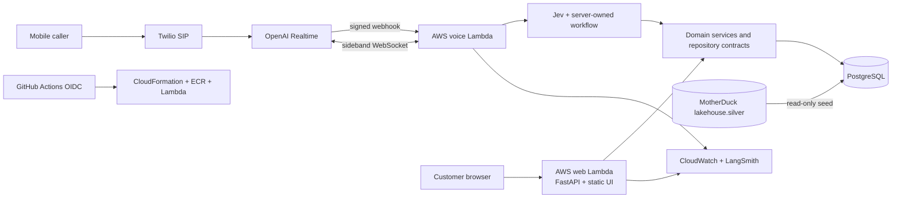

# Dispute Factored Hackathon

An issuer-side prototype that combines a multilingual telephone agent and a synthetic banking web application to improve Visa card-dispute intake in Latin America.

The working journey can identify a synthetic customer, retrieve and rank card transactions, classify unauthorized-card and duplicate-processing reports, map validated evidence to supported Visa condition codes, block a synthetic card when fraud risk is confirmed, create a synthetic complaint, and preserve context for human handoff.

> [!WARNING]
> All customers, transactions, complaints, identity mechanisms and banking actions are synthetic. The application is a hackathon demonstration, not a production banking system. It does not submit a Visa chargeback, issue a refund or provide secure customer authentication.

## Solution architecture



The model interprets natural language and proposes schema-constrained actions. Trusted backend code remains authoritative for identity state, customer scope, transaction access, ranking, Visa mapping, card state, complaint persistence and handoff destination.

Read the detailed [solution architecture and technology stack](https://github.com/dispute-factored-hackathon/dispute-factored-hackathon/wiki/Solution-Architecture-and-Technology-Stack) in the Wiki.

## Technology stack

| Area | Technologies and purpose |
|---|---|
| Cloud infrastructure | AWS Lambda, Lambda Function URLs, ECR, Secrets Manager, CloudWatch Logs, IAM and CloudFormation in `sa-east-1`; GitHub Actions uses OIDC for short-lived deployment access |
| Backend | Python 3.11+, FastAPI, Mangum, Uvicorn, Pydantic, PostgreSQL 16, psycopg 3/pool, Alembic, HTTPX and WebSockets |
| Frontend | Semantic HTML, custom CSS, vanilla JavaScript modules, Fetch API, cookie sessions, JSON i18n catalogs and browser `Intl` formatting; no frontend framework or build step |
| AI engineering | OpenAI Realtime, OpenAI structured output, TypeSafe Jev, LangGraph, LangChain OpenAI, Pydantic tool schemas, LangSmith, deterministic policy gates and evaluation datasets |
| Data engineering | MotherDuck, PostgreSQL, Python ETL/seed pipeline, Pydantic mapping, Alembic, psycopg, Docker Compose and optional DuckDB/pandas/Matplotlib/Seaborn/WordCloud analytics |
| Observability | Structured CloudWatch events, synthetic transcript telemetry, Lambda platform logs, LangSmith traces, PostgreSQL interaction/transcript/CSAT records, Twilio call logs, OpenAI project activity and GitHub Actions |
| Quality and security | Pytest, Ruff, Coverage.py, Radon, Semgrep, optional Gitleaks/SonarQube, signed webhook validation and least-privilege IAM |

### Current deployment boundary

The web and voice Lambdas, Function URLs, ECR image, server-side secrets and CloudWatch groups are deployed. The current `dev` architecture uses PostgreSQL as its operational store and MotherDuck as its synthetic source, but the PostgreSQL and DuckDB CloudFormation stacks were not deployed when this documentation was last verified on 3 October 2026. The next application release must connect the Lambda runtime to PostgreSQL and remove obsolete mock-backend environment settings.

## What the prototype demonstrates

- multilingual telephone intake in Brazilian Portuguese, regional Latin American Spanish and American English;
- synthetic identification using caller data or keypad document entry;
- structured transaction retrieval, explainable reranking and Top-1 confirmation;
- bounded intent decisions through Jev, with Realtime fallback for ambiguous and open-ended turns;
- deterministic classification for unauthorized-card and duplicate-processing evidence;
- Visa 10.3, 10.4 and 12.6.1 candidate mappings after server-side validation;
- synthetic card blocking, complaint persistence and context-preserving human handoff;
- a responsive Factored Bank UI and a separate Shady Business purchase/anomaly simulator;
- confidence gates, prompt-abuse checks, correction paths and explicit confirmation before consequential actions;
- structured logs, agent traces, evaluations and automated engineering checks.

## Repository map

| Path | Purpose |
|---|---|
| [`visa-dispute-hackathon/`](visa-dispute-hackathon/) | Python backend, browser application, voice agent, infrastructure, tests and runtime configuration |
| [GitHub Wiki](https://github.com/dispute-factored-hackathon/dispute-factored-hackathon/wiki) | Canonical research, product, architecture and operating documentation |
| [`data/`](data/) | Authorized synthetic hackathon data and classifier labels |
| [`agents/`](agents/) | Tool-agnostic review-agent definitions |
| [`AGENTS.md`](AGENTS.md) | Instructions for coding agents working in the repository |
| [`CONTRIBUTE.md`](CONTRIBUTE.md) | Contribution workflow and quality requirements |
| [`APPLICATION_LOGS.md`](APPLICATION_LOGS.md) | How to inspect application, call, deployment and trace logs |

## Local setup

Requirements:

- Python 3.11 or newer;
- [`uv`](https://docs.astral.sh/uv/);
- Docker when running local PostgreSQL;
- project-scoped OpenAI, Jev and LangSmith credentials only for the integrations being exercised.

```bash
git clone https://github.com/dispute-factored-hackathon/dispute-factored-hackathon.git
cd dispute-factored-hackathon/visa-dispute-hackathon
cp .env.example .env
uv sync --group dev
```

Never commit `.env`, cloud credentials or API keys.

### Run the web application

After configuring `DATABASE_URL` and applying the documented database setup:

```bash
uv run uvicorn webapp.backend.main:app --host 127.0.0.1 --port 8000
```

Open `http://127.0.0.1:8000`.

### Run the local SIP/webhook service

```bash
uv run dispute-sip-server
```

The complete Twilio/OpenAI configuration and AWS deployment procedure are documented in [`visa-dispute-hackathon/README.md`](visa-dispute-hackathon/README.md).

## Test and validate

```bash
cd visa-dispute-hackathon
uv run pytest -q
uv run ruff check .
uv run ruff format --check .
```

The normal automated suite uses controlled model doubles and should not consume model credits. Tests that require external services or the complete synthetic source are explicitly gated.

## Documentation

The [GitHub Wiki](https://github.com/dispute-factored-hackathon/dispute-factored-hackathon/wiki) is the canonical documentation location. Useful starting points:

- [Solution architecture and technology stack](https://github.com/dispute-factored-hackathon/dispute-factored-hackathon/wiki/Solution-Architecture-and-Technology-Stack)
- [Application logs and traces](https://github.com/dispute-factored-hackathon/dispute-factored-hackathon/wiki/Application-Logs-and-Traces)
- [System data and controls](https://github.com/dispute-factored-hackathon/dispute-factored-hackathon/wiki/System-Data-and-Controls)
- [Visa classification and codes](https://github.com/dispute-factored-hackathon/dispute-factored-hackathon/wiki/Visa-Classification-and-Codes)
- [Functional and non-functional requirements](https://github.com/dispute-factored-hackathon/dispute-factored-hackathon/wiki/Functional-and-Nonfunctional-Requirements)

## Safety and scope

- Use only synthetic or explicitly authorized test data.
- Treat model output as probabilistic and untrusted.
- Keep state-changing decisions behind deterministic validation, confidence thresholds and explicit confirmation.
- Do not weaken abuse controls to make a test pass.
- Do not claim that mocked authentication, transfers, chargebacks or third-party integrations are production services.
- Full transcript logging is acceptable only for this synthetic demonstration and must be disabled or redesigned before real-customer use.

## Contributing

Read [`CONTRIBUTE.md`](CONTRIBUTE.md) before opening a change. AI coding agents must also follow [`AGENTS.md`](AGENTS.md).

## License

This project is available under the [MIT License](LICENSE).
