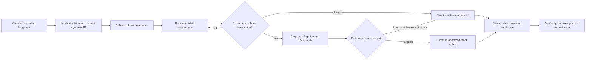

# Future journey with agentic AI

The future journey uses agents as bounded workflow participants. The call-center agent remains the primary human interface and retains authority within their role.

## Improved journey

| Stage | Improved customer experience | Agentic capability | Control and human role | Measure |
|:---:|---|---|---|---|
| 1  Language and access | Chooses language and can correct the system | Multi-utterance language ID suggests routing; accent only improves ASR quality | Customer choice is authoritative; accent never authenticates or determines rights | Language correction, ASR quality and human/interpreter request |
| 2  Demo identification | Supplies full name plus synthetic document/customer ID | Backend creates a `DEMO_ONLY` session for one synthetic customer | Explicitly not secure authentication; no cross-customer access | Unique match, failure, ambiguity and isolation tests |
| 3  Intent and urgency | States the issue once | Speech-to-text and LLM extract allegation, urgency and missing facts | Agent sees original words, transcript quality and alternatives | Intent recall and unsafe urgency miss rate |
| 4  Transaction match | Confirms a short candidate list | Code ranks transactions | Confirmation required before routing | Top-1 and top-3 match |
| 5  Classification | Answers only unresolved questions | LLM and ML propose allegation and Visa family | Versioned rules validate; low confidence abstains | Macro F1, calibration and abstention |
| 6  Immediate protection | Understands what changes now | Tool executes approved reversible action | Least privilege; high risk and exceptions escalate | Time to protection, tool success and unauthorized attempts |
| 7  Evidence assembly | Supplies only relevant evidence | Tools retrieve facts and build checklist | Rules distinguish available, missing and mocked evidence | Evidence completeness |
| 8  Case creation | Confirms a concise read-back | Copilot creates structured case and links | Agent edits and submits | First-contact completeness |
| 9  Handoff | Does not repeat the story | Summary includes assurance, language, original request, transaction, evidence, actions and gaps | Receiving person inspects provenance and accepts ownership | Handoff completeness, acceptance time and repeat-story rate |
| 10  Investigation and updates | Receives status through a verified preferred channel | Workflow monitors deadlines, delivery and promised update | No sensitive message content or unsupported promise | Delivery, comprehension, recontact and missed promises |
| 11  Outcome and appeal | Receives reasoned explanation and next options | System assembles explanation | Human approves denial or adverse outcome | Appeal, comprehension and unsafe denial |

## Mandatory human review

- Low confidence, contradictory evidence or multiple plausible transactions.
- Proposed denial, first-party misuse conclusion or another adverse outcome.
- Critical credential risk, high-value exposure or action beyond the agent's authority.
- Poor transcription quality, accessibility need or language uncertainty that may change meaning.
- Tool failure, stale external state or an unverifiable rule version.
- Failed authentication, language uncertainty or customer request for a person.

## Abuse controls

Every human and AI-agent action is scoped to the active mock session and case. The backend fixes the synthetic `customer_id`; the LLM cannot choose another identity or issue arbitrary data queries. Sensitive values are masked, bulk browsing is restricted, high-impact mock actions require review, and reads, edits and tool calls are audited. Security staff can revoke sessions, disable tools or activate a kill switch.

## Safe fallback

If an AI or tool component fails, the call continues through a documented manual path. The system preserves collected context, labels the unavailable step and prevents duplicate financial or card-control actions when service resumes.

Next: [[System-Data-and-Controls|System data and controls]]
