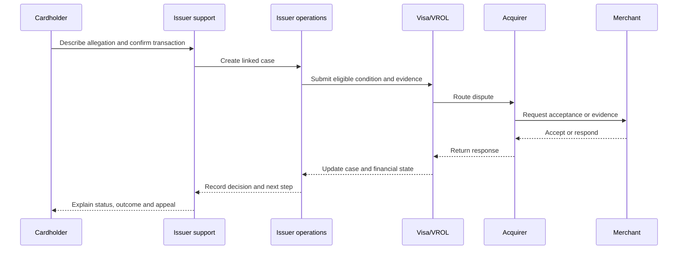

# Stakeholders and responsibilities

| Stakeholder | Role | Issuer responsibility or dependency |
|---|---|---|
| Cardholder | Reports problem, confirms transaction and supplies facts | Protection, status, outcome and appeal information |
| Issuer support | Authenticates, clarifies and creates the case | Reliable prompts, tools and authority boundaries |
| Issuer operations | Investigates, files and manages the network case | Complete evidence, timers and authoritative state |
| Technology and data | Operates identity, card, transaction, case, model and audit systems | Secure integration, lineage and monitoring |
| Risk, compliance and legal | Defines fraud, consumer, privacy and country controls | Versioned policy and accountable exceptions |
| Merchant | Supplies goods/services, may refund or contest | Clear transaction identity and evidence request |
| Acquirer or processor | Serves merchant and exchanges dispute evidence | Network-compliant processing and reconciliation |
| Visa and VROL | Defines network rules and case services | Correct condition, evidence, deadlines and case state |
| Regulator or consumer body | Defines local rights and complaint expectations | Compliant treatment, records and redress |
| Wallet or fintech | May provide token, device or transaction context | Use only when relevant and permitted |
| Receiving bank | Relevant to transfers, not ordinary card chargebacks | Outside current Visa scope |

## Accountability principle

The issuer remains accountable for the customer relationship. Models recommend, tools execute within permission, deterministic rules authorize defined actions, and people decide high-risk outcomes.

Next: [[Visa-Issuer-Dispute-Lifecycle|Visa issuer dispute lifecycle]]
