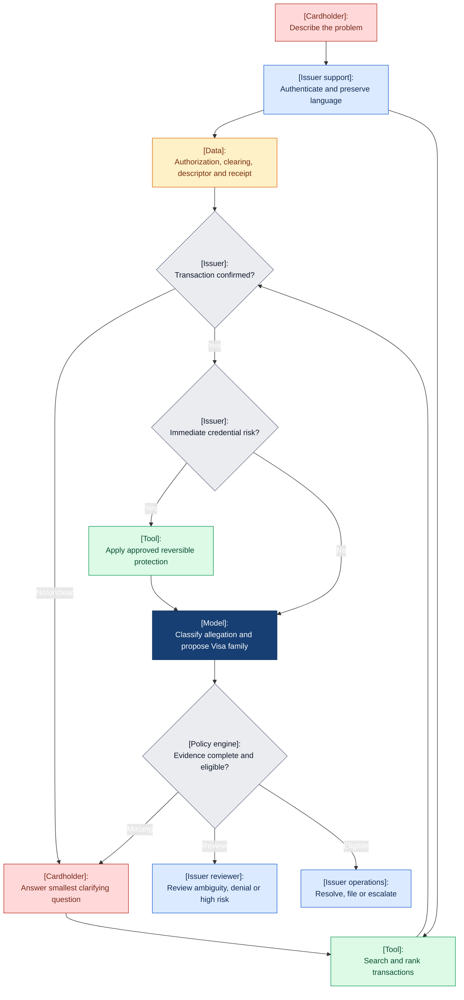
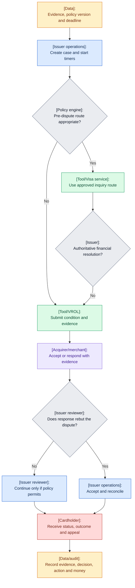

# Visa issuer dispute lifecycle

## Triage and code selection

## After validation

| Failure | Consequence | Control |
|---|---|---|
| Unrecognized descriptor immediately coded as fraud | False report and unnecessary replacement | Merchant recognition and neutral clarification |
| LLM chooses code from language alone | Invalid condition | Allegation model plus deterministic eligibility |
| Wrong transaction | Harm and invalid filing | Ranked candidates plus confirmation |
| Missing evidence | Rework and missed deadline | Code-specific checklist |
| API acceptance treated as completion | False assurance | Explicit accepted/pending/completed/reconciled states |
| Automated denial or misuse allegation | Conduct and fairness risk | Mandatory human review and appeal |

