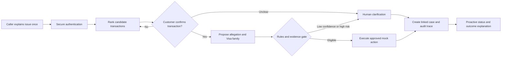

# Future journey with agentic AI

The future journey uses agents as bounded workflow participants. The call-center agent remains the primary human interface and retains authority within their role.

## Improved journey

| Stage | Improved customer experience | Agentic capability | Control and human role | Measure |
|:---:|---|---|---|---|
| 1  Intent and urgency | States the issue once | Speech-to-text and LLM extract allegation, urgency and missing facts | Agent sees original words, confidence and alternatives | Intent recall and unsafe urgency miss rate |
| 2  Authentication | Verification matches risk and accessibility | Workflow retrieves approved context | No model-generated identity decision | Time, failure and abandonment |
| 3  Transaction match | Confirms a short candidate list | Code ranks transactions | Confirmation required before routing | Top-1 and top-3 match |
| 4  Classification | Answers only unresolved questions | LLM and ML propose allegation and Visa family | Versioned rules validate; low confidence abstains | Macro F1, calibration and abstention |
| 5  Immediate protection | Understands what changes now | Tool executes approved reversible action | Agent authorizes within role; high risk escalates | Time to protection and tool success |
| 6  Evidence assembly | Supplies only relevant evidence | Tools retrieve facts and build checklist | Rules distinguish available, missing and mocked evidence | Evidence completeness |
| 7  Case creation | Confirms a concise read-back | Copilot creates structured case and links | Agent edits and submits | First-contact completeness |
| 8  Handoff | Does not repeat the story | Handoff includes narrative, facts and uncertainty | Receiving person accepts ownership | Transfer and repeat-story rate |
| 9  Investigation and updates | Receives truthful status and update time | Workflow monitors deadlines and drafts messages | Rules prevent unsupported promises | Repeat contacts and SLA breach |
| 10  Outcome and appeal | Receives reasoned explanation and next options | System assembles explanation | Human approves denial or adverse outcome | Appeal, comprehension and unsafe denial |

## Mandatory human review

- Low confidence, contradictory evidence or multiple plausible transactions.
- Proposed denial, first-party misuse conclusion or another adverse outcome.
- Critical credential risk, high-value exposure or action beyond the agent's authority.
- Poor transcription quality, accessibility need or language uncertainty that may change meaning.
- Tool failure, stale external state or an unverifiable rule version.

## Safe fallback

If an AI or tool component fails, the call continues through a documented manual path. The system preserves collected context, labels the unavailable step and prevents duplicate financial or card-control actions when service resumes.

Next: [System data and controls](System-Data-and-Controls.md)

